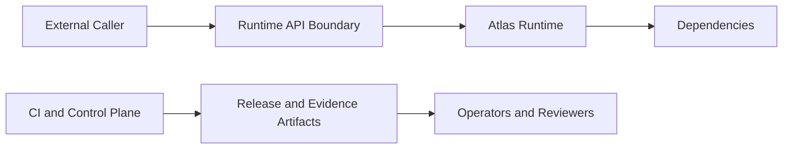

# Trust Boundary Diagram

```mermaid
flowchart LR
    ext[External Caller] --> api[Runtime API Boundary]
    api --> runtime[Atlas Runtime]
    runtime --> deps[Dependencies]
    ci[CI and Control Plane] --> artifacts[Release and Evidence Artifacts]
    artifacts --> reviewers[Operators and Reviewers]
```
