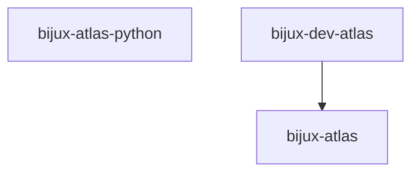

# Crate dependency graph

```mermaid
graph TD
  atlas[bijux-atlas]
  python[bijux-atlas-python]
  dev[bijux-dev-atlas]

  dev --> atlas
```

This graph reflects workspace crate-level dependencies, not third-party crates.
