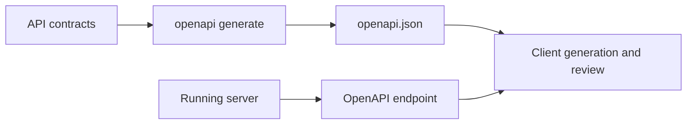
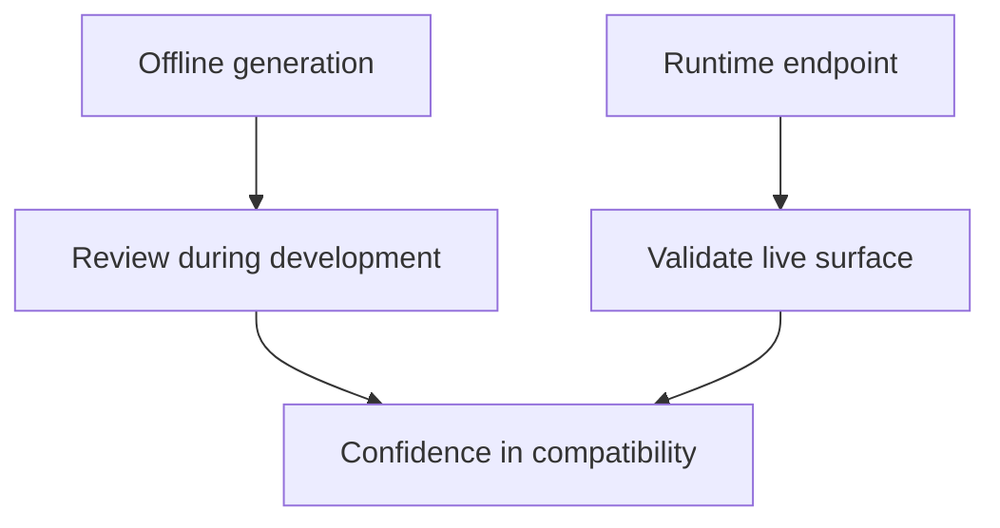

# OpenAPI and API Usage

Atlas exposes its HTTP surface both as running endpoints and as a generated OpenAPI document. Those two views should reinforce each other.

OpenAPI is useful, but it is not magic. It describes contract-owned API shape. It does not replace testing real requests against real published dataset state.

## OpenAPI Relationship



This relationship diagram shows why Atlas publishes OpenAPI in two forms. One is useful before a
server exists, and the other is useful when you need to confirm what a running environment exposes.

## Two Ways to Access the API Description

- offline generation through the CLI
- runtime retrieval through `/v1/openapi.json`

## Generate OpenAPI Offline

```bash
cargo run -p bijux-atlas --bin bijux-atlas -- openapi generate \
  --out configs/generated/openapi/v1/openapi.json
```

Offline generation is best for review, diffing, and contract validation before a server is even running.

## Read OpenAPI from a Running Server

```bash
curl -s http://127.0.0.1:8080/v1/openapi.json
```

Runtime retrieval is best for answering, “What is this environment exposing right now?”

## Why Both Matter



This split matters because OpenAPI serves two distinct jobs: review-time contract inspection and
runtime surface verification. Readers should use the one that matches the question they are asking.

The generated file is useful during code review, CI, and contract validation. The runtime endpoint is useful for confirming what a live server is exposing.

If the two disagree, treat that as a real problem. Either the environment is not running what you think it is, or the contract-generation path has drifted.

## API Usage Guidance

- treat OpenAPI as a description of the contract-owned surface, not as a substitute for operational understanding
- pair endpoint usage with explicit dataset identity fields
- use the generated contract during integration work and the runtime endpoint during environment verification
- do not assume a documented route guarantees the requested dataset is actually published in your current store

## What OpenAPI Does Not Replace

- real query tests against published dataset state
- operational checks such as readiness, metrics, and policy behavior
- compatibility review for changes that affect more than surface shape

## Where to Read More

- [API Endpoint Index](api-endpoint-index.md)
- [API Compatibility](../contracts/api-compatibility.md)
*** Add File: /Users/bijan/bijux/bijux-atlas/docs/repository/bijux-atlas/contracts/contract-reading-guide.md
---
title: Contract Reading Guide
audience: mixed
type: guide
status: canonical
owner: atlas-docs
last_reviewed: 2026-04-12
---

# Contract Reading Guide

Not every Atlas page makes the same strength of promise.

Use the contract slice when you need an intentional stability statement. Use
the foundations, workflows, interfaces, and runtime slices when you need
mental models, task guidance, or current architecture.

## Reading Rule

- if downstream integrations rely on it, read the contract page
- if the question is exact compatibility or versioning, stay here
- if the question is how to use the product, move back to repository workflows
*** Add File: /Users/bijan/bijux/bijux-atlas/docs/repository/bijux-atlas/contracts/compatibility-review-checklist.md
---
title: Compatibility Review Checklist
audience: maintainers
type: guide
status: canonical
owner: atlas-docs
last_reviewed: 2026-04-12
---

# Compatibility Review Checklist

Use this checklist when a change might alter a repository-owned Atlas promise.

## Review Questions

- does the change affect a documented API, config, output, or artifact rule
- is the behavior covered by compatibility or contract tests
- does release evidence need to call out the change explicitly
- are redirects, docs, and generated references still aligned

## Outcome

The goal is to keep contract changes intentional, reviewable, and visible
before they escape as accidental drift.

## Purpose

This page explains the Atlas material for openapi and api usage and points readers to the canonical checked-in workflow or boundary for this topic.

## Stability

This page is part of the canonical Atlas docs spine. Keep it aligned with the current repository behavior and adjacent contract pages.
