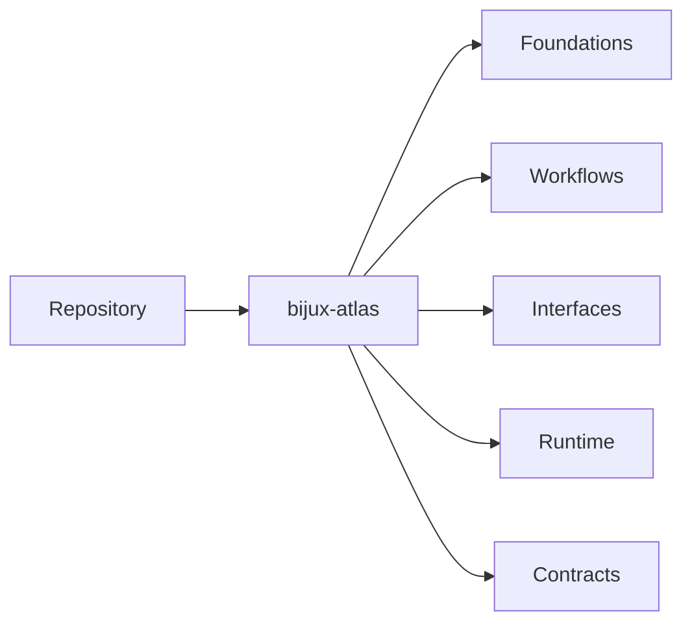

# Repository

The repository handbook is the product-facing Atlas handbook for
`bijux-atlas`.

It will hold the deep documentation for the runtime package itself:

- product identity and boundaries
- ingest, dataset, and query workflows
- API and runtime interfaces
- source layout and runtime architecture
- published contracts for downstream users

## Scope

Use this handbook when the question is about what Atlas does as a product,
how users and integrators interact with it, and which runtime promises are
intended to stay stable.

## What Comes Next

The repository handbook is being rebuilt around `repository/bijux-atlas/`
with five durable subdirectories so the Atlas product surface can carry more
depth without mixing in maintainer-only or operations-only material.

## Current Paths

The first active repository slice is `repository/bijux-atlas/foundations/`.
It establishes the conceptual model for the runtime package before the
workflow, interface, runtime, and contract slices are migrated.

The next active slice is `repository/bijux-atlas/workflows/`, which carries
the user-facing Atlas product flows for install, ingest, dataset preparation,
server startup, and first queries.

The `repository/bijux-atlas/interfaces/` slice carries the exact runtime
surface for commands, API shape, config, flags, and machine-facing reference.

The `repository/bijux-atlas/runtime/` slice carries the product architecture
for ingest, storage, request flow, artifact movement, and runtime process
composition.

The `repository/bijux-atlas/contracts/` slice carries the stable promises for
API behavior, runtime configuration, artifacts, operations, and compatibility
decisions.
