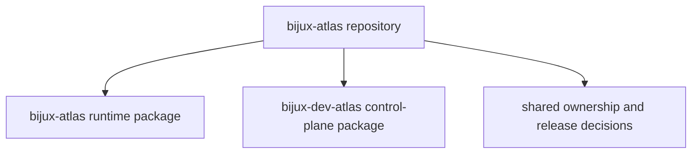

# Repository Handbook

`bijux-atlas` is intentionally split into a product runtime package and a
repository control-plane package. This handbook exists to explain that split,
route readers to the right owner quickly, and keep repository-level decisions
separate from package-local detail.

<strong>Use this as the arbitration layer.</strong>
If a question crosses runtime and maintainer boundaries, or if package-local
docs seem to disagree, start here before you assume one side owns the whole
story.

<a class="md-button md-button--primary" href="packages/">Open the repository package inventory</a>
<a class="md-button" href="../runtime/">Open the runtime handbook</a>
<a class="md-button" href="../maintainer/">Open the maintainer handbook</a>

## Visual Summary

## Start Here

- open [Repository Packages](packages/index.md) to identify which package owns a concern
- open [Runtime Handbook](../runtime/index.md) when the issue is dataset delivery, APIs, or runtime operations
- open [Maintainer Handbook](../maintainer/index.md) when the issue is repository automation, docs tooling, policy, or reports

## Decision Rule

Stay in this handbook when the question is about package boundaries, repository
scope, or cross-package change impact. Move into the package handbooks once the
owner is clear.
