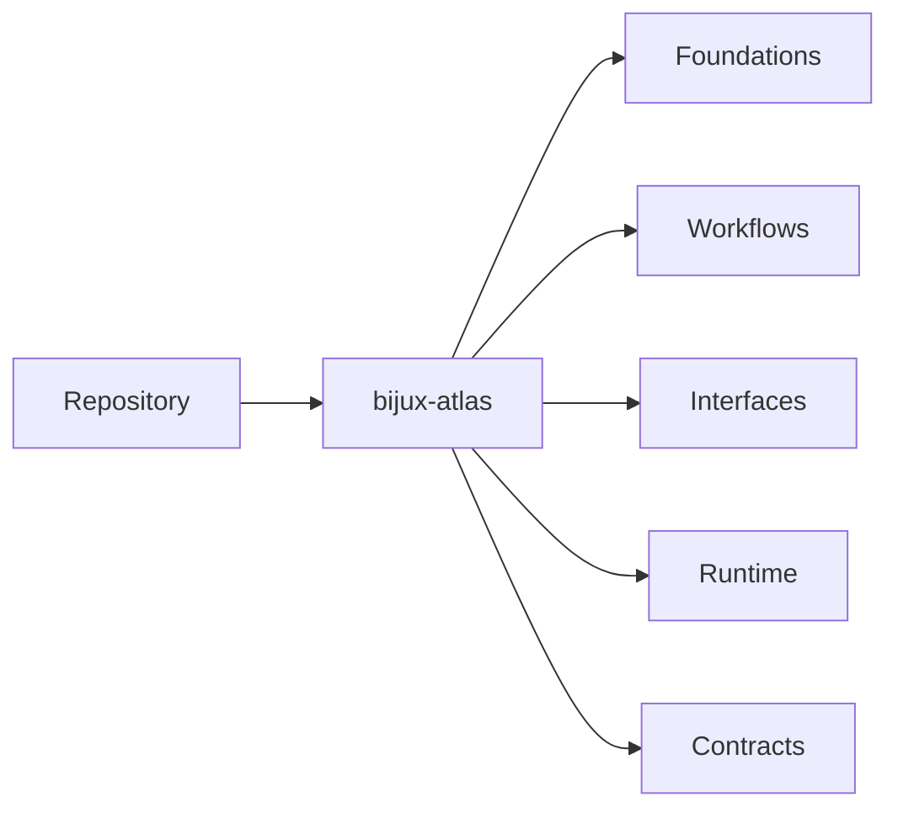

# Repository

The repository handbook is the product-facing Atlas handbook for
`bijux-atlas`.

It will hold the deep documentation for the runtime package itself:

- product identity and boundaries
- ingest, dataset, and query workflows
- API and runtime interfaces
- source layout and runtime architecture
- published contracts for downstream users

## Scope

Use this handbook when the question is about what Atlas does as a product,
how users and integrators interact with it, and which runtime promises are
intended to stay stable.

## What Comes Next

The repository handbook is being rebuilt around `repository/bijux-atlas/`
with five durable subdirectories so the Atlas product surface can carry more
depth without mixing in maintainer-only or operations-only material.

## Current Paths

The first active repository slice is `repository/bijux-atlas/foundations/`.
It establishes the conceptual model for the runtime package before the
workflow, interface, runtime, and contract slices are migrated.

The next active slice is `repository/bijux-atlas/workflows/`, which carries
the user-facing Atlas product flows for install, ingest, dataset preparation,
server startup, and first queries.

The `repository/bijux-atlas/interfaces/` slice carries the exact runtime
surface for commands, API shape, config, flags, and machine-facing reference.

The `repository/bijux-atlas/runtime/` slice carries the product architecture
for ingest, storage, request flow, artifact movement, and runtime process
composition.

The `repository/bijux-atlas/contracts/` slice carries the stable promises for
API behavior, runtime configuration, artifacts, operations, and compatibility
decisions.

## Foundations Pages

- [What Atlas Is](bijux-atlas/foundations/what-atlas-is.md)
- [Core Concepts](bijux-atlas/foundations/core-concepts.md)
- [Boundaries and Non-Goals](bijux-atlas/foundations/boundaries-and-non-goals.md)
- [Guarantees and Stability](bijux-atlas/foundations/guarantees-and-stability.md)
- [Package Ownership](bijux-atlas/foundations/package-ownership.md)
- [Dataset Model](bijux-atlas/foundations/dataset-model.md)
- [Release Model](bijux-atlas/foundations/release-model.md)
- [Query Model](bijux-atlas/foundations/query-model.md)
- [Runtime Surfaces](bijux-atlas/foundations/runtime-surfaces.md)
- [Documentation Map](bijux-atlas/foundations/documentation-map.md)

## Workflows Pages

- [Install and Verify](bijux-atlas/workflows/install-and-verify.md)
- [Run Atlas Locally](bijux-atlas/workflows/run-atlas-locally.md)
- [Load a Sample Dataset](bijux-atlas/workflows/load-a-sample-dataset.md)
- [Start the Server](bijux-atlas/workflows/start-the-server.md)
- [Run Your First Queries](bijux-atlas/workflows/run-your-first-queries.md)
- [Troubleshoot Early Problems](bijux-atlas/workflows/troubleshoot-early-problems.md)
- [Catalog Workflows](bijux-atlas/workflows/catalog-workflows.md)
- [Dataset Workflows](bijux-atlas/workflows/dataset-workflows.md)
- [Ingest Workflows](bijux-atlas/workflows/ingest-workflows.md)
- [Query Workflows](bijux-atlas/workflows/query-workflows.md)

## Interfaces Pages

- [Configuration and Output](bijux-atlas/interfaces/configuration-and-output.md)
- [Server Workflows](bijux-atlas/interfaces/server-workflows.md)
- [OpenAPI and API Usage](bijux-atlas/interfaces/openapi-and-api-usage.md)
- [Policy Workflows](bijux-atlas/interfaces/policy-workflows.md)
- [Command Surface](bijux-atlas/interfaces/command-surface.md)
- [Environment Variables](bijux-atlas/interfaces/environment-variables.md)
- [Runtime Config Reference](bijux-atlas/interfaces/runtime-config-reference.md)
- [API Endpoint Index](bijux-atlas/interfaces/api-endpoint-index.md)
- [Error Codes and Exit Codes](bijux-atlas/interfaces/error-codes-and-exit-codes.md)
- [Feature Flags](bijux-atlas/interfaces/feature-flags.md)

## Runtime Pages

- [System Overview](bijux-atlas/runtime/system-overview.md)
- [Source Layout and Ownership](bijux-atlas/runtime/source-layout-and-ownership.md)
- [Request Lifecycle](bijux-atlas/runtime/request-lifecycle.md)
- [Ingest Architecture](bijux-atlas/runtime/ingest-architecture.md)
- [Query Architecture](bijux-atlas/runtime/query-architecture.md)
- [Storage Architecture](bijux-atlas/runtime/storage-architecture.md)
- [Runtime Composition](bijux-atlas/runtime/runtime-composition.md)
- [Artifact Lifecycle](bijux-atlas/runtime/artifact-lifecycle.md)
- [Serving Store Model](bijux-atlas/runtime/serving-store-model.md)
- [Runtime Process Model](bijux-atlas/runtime/runtime-process-model.md)

## Contracts Pages

- [Contracts and Boundaries](bijux-atlas/contracts/contracts-and-boundaries.md)
- [API Compatibility](bijux-atlas/contracts/api-compatibility.md)
- [Structured Output Contracts](bijux-atlas/contracts/structured-output-contracts.md)
- [Runtime Config Contracts](bijux-atlas/contracts/runtime-config-contracts.md)
- [Plugin Contracts](bijux-atlas/contracts/plugin-contracts.md)
- [Artifact and Store Contracts](bijux-atlas/contracts/artifact-and-store-contracts.md)
- [Operational Contracts](bijux-atlas/contracts/operational-contracts.md)
- [Ownership and Versioning](bijux-atlas/contracts/ownership-and-versioning.md)
- [Contract Reading Guide](bijux-atlas/contracts/contract-reading-guide.md)
- [Compatibility Review Checklist](bijux-atlas/contracts/compatibility-review-checklist.md)
