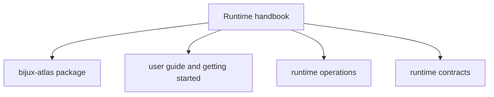

# Runtime Handbook

`bijux-atlas` is the product-facing Atlas runtime. This handbook owns the user
and operator story for ingest, datasets, catalog workflows, APIs, runtime
operations, reference facts, and stable runtime contracts.

<a class="md-button md-button--primary" href="packages/bijux-atlas/">Open the bijux-atlas package</a>
<a class="md-button" href="../03-user-guide/">Open the user guide</a>
<a class="md-button" href="../04-operations/">Open runtime operations</a>

## Visual Summary

## Package Destination

- [`bijux-atlas`](packages/bijux-atlas/index.md) owns the Atlas product runtime
  and its stable interfaces

## Read This Handbook When

- you need to understand Atlas ingest, dataset, catalog, query, or server workflows
- you are operating Atlas in environments where runtime configuration, recovery, or observability matters
- you need the stable runtime reference or contract surfaces instead of maintainer-only automation

## Main Paths

- [Introduction](../01-introduction/index.md)
- [Getting Started](../02-getting-started/index.md)
- [User Guide](../03-user-guide/index.md)
- [Operations](../04-operations/index.md)
- [Architecture](../05-architecture/index.md)
- [Reference](../07-reference/index.md)
- [Contracts](../08-contracts/index.md)

## Related Handbooks

- [Repository Handbook](../repository/index.md)
- [Maintainer Handbook](../maintainer/index.md)
